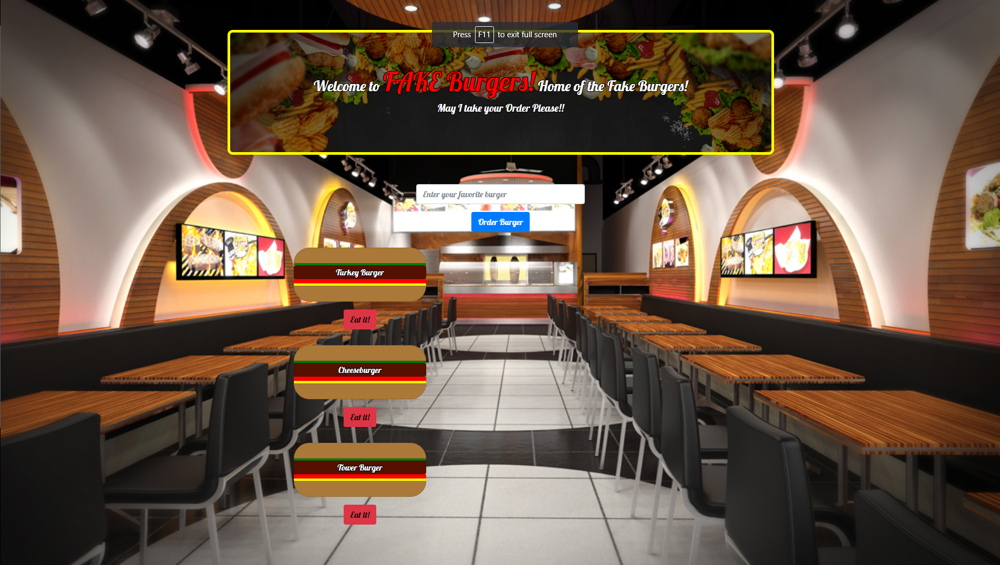

# BurgerBuilder!

Burger Builder is a logging app made with `MySQL`, `custom ORM`, `NodeJS`, `ExpressJS`, `Bootstrap` and `Handlebars` to generate javascript on HTML. 


M(odel), V(iew), C(ontrol) design was used to create the application. 



# How it works

Burger Builder is an app that let users create their own burger which will be generated with an `EAT IT` button under their custom burger. 

Click the Eat it button and it will be moved to right side of page with a `RETURN IT` button generated under the same burger.

### Prerequisites
[Node.js](http://www.nodejs.org) | [MySQL](http://www.mysql.com) | [jQuery](https://jQuery.com) |

### Installing 

1. `git clone` the repo to your computer


2. `yarn` or `npm install` in root folder, to install all dependencies 


3. SET UP SQL DATABASE
- You will need [MySQL](http://www.mysql.com) installed, please visit link to download s/w. 
- Go `to burger/config/connection.js` of the app and change `password` (`host user database` IF necessary) 
- Copy Schema from `db folder`
- Open MySQL and DROP/CREATE DB on PC.


```
var connection = mysql.createConnection({
  host: "localhost",
  user: "root",
  password: "password",
  database: "burgers_db"
});
```
4. Run `node server.js` in the root of project to start server.

5. You should find the game on `localhost:3000`

## Built With
+ [Node.js](https://nodejs.org/en/)
+ [ExpressJS](https://expressjs.com)
+ [Yarn](https://yarnpkg.com/en/)
+ [BootStrap](https://getbootstrap.com)
+ [jQuery](https://jQuery.com)
+ [Google Fonts](https://fonts.google.com/)
+ [HandleBarsJS](https://handlebarsjs.com/)
+ [MySQL](http://mysql.com)


### Author 
- Daniel Oh-[danniboi82](http://www.github.com/danniboi82)


